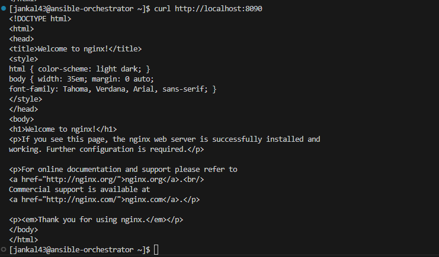
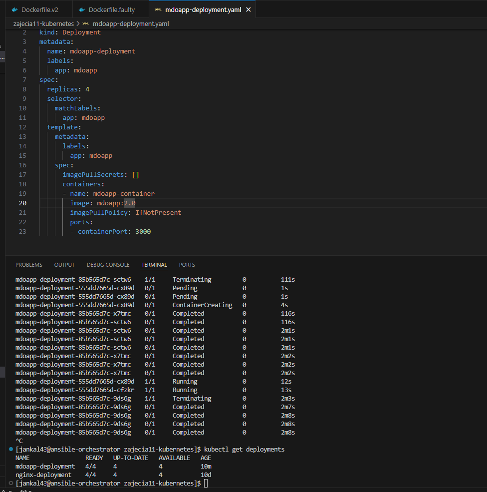
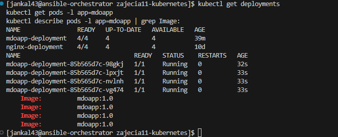

# Sprawozdanie: Automatyzacja i Zdalne Wykonywanie Poleceń za Pomocą Ansible

## Wprowadzenie

Celem niniejszego ćwiczenia jest zapoznanie się z narzędziem Ansible, służącym do automatyzacji zarządzania konfiguracją oraz zdalnego wykonywania zadań na wielu systemach jednocześnie. W ramach sprawozdania zostanie przedstawiony proces instalacji Ansible na maszynie kontrolnej, konfiguracji maszyn zarządzanych (endpointów), tworzenia inwentarza systemów, wykonywania zadań ad-hoc oraz implementacji złożonych operacji za pomocą playbooków i ról Ansible. Ćwiczenie obejmuje również zarządzanie artefaktem (obrazem Docker) z poprzednich zajęć przy użyciu Ansible.

## Część 1: Instalacja Zarządcy Ansible i Przygotowanie Środowiska

Pierwszym krokiem było przygotowanie odpowiedniego środowiska pracy, składającego się z maszyny kontrolnej (orchestratora) oraz maszyny zarządzanej (endpointu).

### 1.1. Przygotowanie Maszyny Zarządzanej (`ansible-target`)

Zgodnie z poleceniem, utworzono nową maszynę wirtualną, która będzie pełniła rolę endpointu zarządzanego przez Ansible.
*   **System Operacyjny:** Fedora (wersja zgodna z maszyną orchestratora).
*   **Wymagane oprogramowanie:** Zapewniono obecność programu `tar` oraz serwera OpenSSH (`sshd`) do komunikacji.
*   **Hostname:** Maszynie nadano hostname `ansible-target` podczas procesu instalacji.
*   **Użytkownik:** Utworzono dedykowanego użytkownika `ansible` na tej maszynie, który będzie wykorzystywany przez Ansible do logowania i wykonywania zadań. Użytkownik ten posiada uprawnienia do wykonywania poleceń z `sudo` bez potrzeby podawania hasła (konfiguracja w pliku `/etc/sudoers.d/ansible` z wpisem `ansible ALL=(ALL) NOPASSWD:ALL`).


Po pomyślnej konfiguracji maszyny ansible-target, zgodnie z dobrymi praktykami oraz zaleceniami zadania, wykonano jej migawkę (snapshot). Pozwala to na szybkie przywrócenie stanu maszyny do tego punktu w przypadku ewentualnych problemów podczas dalszych etapów konfiguracji lub testów.


### 1.2. Instalacja Ansible na Maszynie Kontrolnej (`ansible-orchestrator`)

Na głównej maszynie wirtualnej, pełniącej rolę orchestratora, zainstalowano oprogramowanie Ansible. Wykorzystano do tego menedżer pakietów `dnf` dostępny w systemie Fedora.

```bash
sudo dnf install ansible -y
```

Po instalacji sprawdzono wersję Ansible, aby potwierdzić poprawność instalacji:

```bash
ansible --version
```


### 1.3. Konfiguracja Użytkownika `ansible` i Wymiana Kluczy SSH

Aby umożliwić Ansible bezhasłowe logowanie do maszyny zarządzanej, konieczne było skonfigurowanie użytkownika `ansible` na maszynie kontrolnej oraz wymiana kluczy SSH.


Na maszynie `ansible-orchestrator` utworzono użytkownika `ansible`. Następnie, działając jako ten użytkownik (lub z jego uprawnieniami), wygenerowano parę kluczy SSH (publiczny i prywatny):

Następnie klucz publiczny użytkownika `ansible` z maszyny `ansible-orchestrator` został skopiowany do pliku `~/.ssh/authorized_keys` użytkownika `ansible` na maszynie `ansible-target`. Użyto do tego polecenia `ssh-copy-id`:

```bash
ssh-copy-id ansible@ansible-target
```
Ten krok wymaga jednorazowego podania hasła użytkownika `ansible` na maszynie `ansible-target`.

Po pomyślnym skopiowaniu klucza, przetestowano połączenie SSH z maszyny `ansible-orchestrator` do `ansible-target` jako użytkownik `ansible`. Połączenie powinno zostać nawiązane bez pytania o hasło.

```bash
ssh ansible@ansible-target
```


Ta konfiguracja jest kluczowa dla działania Ansible, które polega na połączeniach SSH do zarządzania hostami.


## Część 2: Inwentaryzacja Systemów

Po przygotowaniu maszyn i zapewnieniu podstawowej komunikacji SSH, kolejnym krokiem jest zdefiniowanie dla Ansible, którymi maszynami ma zarządzać. Służy do tego plik inwentarza.

### 2.1. Ustalenie Nazw Hostów i Konfiguracja Rozpoznawania Nazw

Aby ułatwić identyfikację maszyn, nadano im przewidywalne nazwy. Maszyna zarządzana otrzymała hostname `ansible-target` już podczas instalacji. Głównej maszynie wirtualnej (orchestratorowi) nadano hostname `ansible-orchestrator` za pomocą polecenia `hostnamectl`:

Na maszynie `ansible-orchestrator`:
```bash
sudo hostnamectl set-hostname ansible-orchestrator
```


Następnie, aby umożliwić komunikację między maszynami z użyciem ich nazw (a nie tylko adresów IP), zaktualizowano pliki `/etc/hosts` na obu maszynach.

Na maszynie `ansible-orchestrator` dodano wpis dla `ansible-target`:
```bash
sudo nano /etc/hosts
```

Analogicznie, na maszynie `ansible-target` dodano wpis dla `ansible-orchestrator`:
```bash
sudo nano /etc/hosts
```


### 2.2. Weryfikacja Łączności

Po konfiguracji nazw, zweryfikowano podstawową łączność sieciową między maszynami za pomocą polecenia `ping`, używając nowo zdefiniowanych nazw hostów.

Z maszyny `ansible-orchestrator` do `ansible-target`:
```bash
ping ansible-target
```


Z maszyny `ansible-target` do `ansible-orchestrator`:
```bash
ping ansible-orchestrator
```


Pomyślne wyniki testów `ping` potwierdziły, że obie maszyny są widoczne w sieci i poprawnie rozpoznają swoje nazwy.

### 2.3. Stworzenie Pliku Inwentarza Ansible

Plik inwentarza (`inventory.ini`) jest sercem konfiguracji Ansible, definiującym zarządzane hosty i ich grupy. Utworzono plik `inventory.ini` w katalogu roboczym na maszynie `ansible-orchestrator`.

Początkowa zawartość pliku `inventory.ini`:
```ini
[orchestrators]
localhost ansible_connection=local

[endpoints]
ansible-target ansible_user=ansible
```
Powyższy plik definiuje dwie grupy: `orchestrators` (zawierającą maszynę kontrolną) oraz `endpoints` (zawierającą maszynę zarządzaną).


Następnie przetestowano konfigurację inwentarza za pomocą modułu `ping` Ansible, który sprawdza, czy Ansible jest w stanie połączyć się z hostami i wykonać na nich prosty kod Pythonowy.

```bash
ansible all -i inventory.ini -m ping
```


   
Wynik "SUCCESS" dla obu hostów (`localhost` i `ansible-target`) potwierdza, że Ansible jest gotowy do zarządzania zdefiniowanymi systemami.


## Część 3: Zdalne Wywoływanie Procedur za Pomocą Playbooka

Playbooki Ansible pozwalają na definiowanie złożonych sekwencji zadań do wykonania na zarządzanych hostach. Zgodnie z zadaniem, utworzono playbook `playbook.yml` realizujący serię operacji na maszynie `ansible-target`.

### 3.1. Tworzenie Playbooka `playbook.yml`

Plik `playbook.yml` został utworzony na maszynie `ansible-orchestrator` i zawiera następujące zadania:

```yaml
---
- name: Operacje zdalne na maszynach końcowych
  hosts: endpoints
  become: true
  tasks:
    - name: Ping - sprawdzenie łączności
      ansible.builtin.ping:

    - name: Skopiuj plik inwentaryzacji na maszynę docelową
      ansible.builtin.copy:
        src: inventory.ini
        dest: /home/ansible/inventory.ini
        owner: ansible
        mode: '0644'

    - name: Ping - ponownie sprawdź łączność
      ansible.builtin.ping:

    - name: Aktualizuj pakiety (dnf)
      ansible.builtin.dnf:
        name: "*"
        state: latest
        update_cache: yes

    - name: Restart usługi sshd
      ansible.builtin.service:
        name: sshd
        state: restarted

    - name: Restart usługi rngd (jeśli istnieje)
      ansible.builtin.service:
        name: rngd
        state: restarted
      ignore_errors: yes
```


**Uzasadnienie struktury playbooka:**
*   `name: Operacje zdalne na maszynach końcowych`: Opisowa nazwa dla całego playbooka.
*   `hosts: endpoints`: Określa, że zadania z tego "play-a" będą wykonywane na hostach zdefiniowanych w grupie `endpoints` w pliku `inventory.ini`.
*   `become: true`: Wskazuje, że zadania w tym play-u powinny być wykonywane z podniesionymi uprawnieniami (równoważne `sudo`). Jest to konieczne dla zadań takich jak aktualizacja pakietów czy restart usług.
*   `tasks:`: Lista zadań do wykonania.
    *   **Ping - sprawdzenie łączności**: Pierwsze zadanie wykorzystuje moduł `ansible.builtin.ping` do weryfikacji podstawowej łączności z hostem przed wykonaniem dalszych operacji.
    *   **Skopiuj plik inwentaryzacji**: Moduł `ansible.builtin.copy` kopiuje plik `inventory.ini` z maszyny orchestratora do katalogu domowego użytkownika `ansible` na maszynie docelowej (`ansible-target`). Ustawiono właściciela (`owner`) i uprawnienia (`mode`) dla skopiowanego pliku.
    *   **Ping - ponownie sprawdź łączność**: Kolejne wywołanie modułu `ping`. W zadaniu polecono "ponów operację, porównaj różnice w wyjściu". Pierwsze wykonanie zadania kopiowania pliku powinno zwrócić `changed: true`. Drugie uruchomienie tego samego playbooka (bez zmian w pliku źródłowym `inventory.ini`) powinno dla tego zadania zwrócić `changed: false` (lub `ok`), demonstrując idempotentność Ansible. W tym konkretnym playbooku mamy jednak dwa osobne zadania ping, a nie ponowne wykonanie kopiowania.
    *   **Aktualizuj pakiety (dnf)**: Moduł `ansible.builtin.dnf` służy do zarządzania pakietami w systemach bazujących na RPM (jak Fedora). `name: "*"` i `state: latest` oznaczają aktualizację wszystkich zainstalowanych pakietów do najnowszych dostępnych wersji. `update_cache: yes` zapewnia odświeżenie lokalnej pamięci podręcznej metadanych pakietów przed próbą aktualizacji.
    *   **Restart usługi sshd**: Moduł `ansible.builtin.service` zarządza usługami systemowymi. Tutaj restartuje usługę `sshd`.
    *   **Restart usługi rngd (jeśli istnieje)**: Próba restartu usługi `rng-tools` (`rngd`), która jest często używana do generowania entropii. Dodano `ignore_errors: yes`, ponieważ usługa `rngd` może nie być zainstalowana/aktywna na wszystkich systemach (szczególnie na minimalnych instalacjach), a jej brak nie powinien przerywać wykonania całego playbooka.

### 3.2. Uruchomienie Playbooka

Playbook został uruchomiony z maszyny `ansible-orchestrator` za pomocą polecenia `ansible-playbook`:

```bash
ansible-playbook -i inventory.ini playbook.yml
```


**Analiza wyniku wykonania**
*   **TASK [Gathering Facts]**: Zawsze wykonywane na początku (chyba że wyłączone), zbiera informacje o systemie docelowym. Stan: `ok`.
*   **TASK [Ping - sprawdzenie łączności]**: Pomyślnie. Stan: `ok`.
*   **TASK [Skopiuj plik inwentaryzacji na maszynę docelową]**: Plik został skopiowany. Stan: `changed`. Oznacza to, że stan systemu docelowego uległ zmianie (plik został utworzony lub zaktualizowany).
*   **TASK [Ping - ponowne sprawdź łączność]**: Pomyślnie. Stan: `ok`.
*   **TASK [Aktualizuj pakiety (dnf)]**: Pakiety zostały zaktualizowane. Stan: `changed`.
*   **TASK [Restart usługi sshd]**: Usługa `sshd` została zrestartowana. Stan: `changed`.
*   **TASK [Restart usługi rngd (jeśli istnieje)]**: Zadanie zakończyło się błędem (`fatal`), ponieważ usługa `rngd` nie została znaleziona na maszynie `ansible-target`. Jednak dzięki `ignore_errors: yes`, błąd ten został zignorowany (`ignored=1` w podsumowaniu `PLAY RECAP`), a playbook kontynuował swoje działanie.

W podsumowaniu `PLAY RECAP` dla `ansible-target` widzimy: `ok=7`, `changed=3`, `unreachable=0`, `failed=0`, `skipped=0`, `rescued=0`, `ignored=1`. Oznacza to, że 3 zadania dokonały zmian w systemie, a jedno zadanie, mimo błędu, zostało zignorowane i nie przerwało całości.


---

### 3.3. Testowanie Odporności Ansible na Problemy z Łącznością

Istotnym elementem oceny narzędzi do automatyzacji jest ich zdolność do obsługi sytuacji awaryjnych, takich jak utrata łączności z zarządzanymi systemami. W ramach ćwiczenia przeprowadzono test mający na celu weryfikację zachowania Ansible w przypadku, gdy maszyna docelowa (`ansible-target`) staje się nieosiągalna poprzez protokół SSH.


W celu przeprowadzenia kontrolowanego testu, na maszynie `ansible-target` celowo zatrzymano usługę serwera OpenSSH. Operacja ta została wykonana przed ponownym uruchomieniem playbooka z maszyny `ansible-orchestrator`.

Na maszynie `ansible-target`:
```bash
sudo systemctl stop sshd
```
Zatrzymanie usługi `sshd` spowodowało, że maszyna `ansible-target` przestała akceptować nowe połączenia SSH na porcie 22, symulując tym samym jej niedostępność dla Ansible.

Próba Wykonania Playbooka na Niedostępnym Hoście

Po wyłączeniu serwera SSH na maszynie `ansible-target`, z poziomu maszyny `ansible-orchestrator` podjęto próbę wykonania wcześniej zdefiniowanego playbooka `playbook.yml` za pomocą polecenia:

```bash
ansible-playbook -i inventory.ini playbook.yml
```

Wynik tej operacji, przedstawiony na zrzucie ekranu poniżej, unaocznił reakcję Ansible na brak możliwości nawiązania połączenia z hostem docelowym.


**Analiza wyniku:**
Jak zaobserwowano na przedstawionym zrzucie ekranu, Ansible już na etapie początkowego zadania `TASK [Gathering Facts]` napotkał krytyczny problem z komunikacją z hostem `ansible-target`. System zgłosił następujący błąd:

```
fatal: [ansible-target]: UNREACHABLE! => {
    "changed": false,
    "msg": "Failed to connect to the host via ssh: ssh: connect to host ansible-target port 22: Connection timed out",
    "unreachable": true
}
```

Komunikat `Failed to connect to the host via ssh: ssh: connect to host ansible-target port 22: Connection timed out` jednoznacznie wskazuje, że próba nawiązania sesji SSH z maszyną `ansible-target` zakończyła się niepowodzeniem z powodu przekroczenia limitu czasu oczekiwania na odpowiedź. W rezultacie, host `ansible-target` został sklasyfikowany przez Ansible jako `UNREACHABLE`.

Podsumowanie wykonania playbooka (`PLAY RECAP`) precyzyjnie odzwierciedliło zaistniałą sytuację:
```
PLAY RECAP *********************************************************************
ansible-target             : ok=0    changed=0    unreachable=1    failed=0    skipped=0    rescued=0    ignored=0
```
Potwierdza to, że żadne zadania nie zostały pomyślnie wykonane na hoście `ansible-target`, a jego stan został poprawnie zidentyfikowany jako nieosiągalny.

**Wnioski z przeprowadzonego testu:**
Przeprowadzony scenariusz wykazał, że Ansible jest wyposażony w mechanizmy pozwalające na detekcję i odpowiednie raportowanie problemów związanych z brakiem łączności SSH do zarządzanych węzłów. Zdolność do identyfikacji hostów jako `UNREACHABLE` jest kluczowa dla administratorów systemów, umożliwiając szybkie zdiagnozowanie problemów w infrastrukturze i podjęcie stosownych działań naprawczych. Test ten potwierdza robustność Ansible w kontekście obsługi błędów komunikacyjnych.

---


---


## Część 4: Automatyzacja Wdrożenia Systemu i Aplikacji za Pomocą Plików Odpowiedzi Kickstart

Kolejnym etapem projektu było zautomatyzowanie procesu instalacji systemu operacyjnego Fedora wraz z niezbędnym oprogramowaniem oraz wdrożeniem aplikacji kontenerowej, przygotowanej w ramach wcześniejszych zadań. Wykorzystano do tego mechanizm plików odpowiedzi Kickstart, umożliwiający nienadzorowaną instalację systemu.

### 4.1. Przygotowanie Bazowego Pliku Odpowiedzi Kickstart

Prace rozpoczęto od przygotowania podstawowego pliku odpowiedzi Kickstart. Punktem wyjścia mógł być plik `/root/anaconda-ks.cfg` generowany automatycznie po standardowej instalacji systemu Fedora, który następnie został zmodyfikowany w celu spełnienia podstawowych wymagań zadania:

*   **Zdefiniowano źródła instalacji (repozytoria):** Dodano dyrektywy `url` i `repo` wskazujące na oficjalne mirrory Fedory 41, co jest kluczowe przy korzystaniu z instalatora sieciowego (Netinstall) lub gdy wybrana grupa pakietów nie znajduje się w całości na nośniku instalacyjnym.
*   **Skonfigurowano układ klawiatury i język systemu:** Ustawiono polski układ klawiatury oraz język systemu `pl_PL.UTF-8`.
*   **Ustawiono informacje sieciowe:** Skonfigurowano interfejs sieciowy do pracy w trybie DHCP oraz zdefiniowano niestandardowy hostname dla maszyny.
*   **Zarządzanie partycjami:** Zapewniono, że dysk docelowy (`sda`) będzie w całości formatowany przed instalacją poprzez użycie `clearpart --all --initlabel`, a następnie zastosowano automatyczne partycjonowanie LVM (`autopart --type=lvm`).
*   **Zainstalowano podstawową grupę pakietów:** Wybrano grupę pakietów `@^server-product-environment` (lub alternatywnie `@^minimal-environment` dla bardziej oszczędnej instalacji), która dostarcza środowisko serwerowe.
*   **Skonfigurowano dane użytkownika i hasło root:** Zdefiniowano zaszyfrowane hasło dla użytkownika root oraz utworzono użytkownika `kaletka` z uprawnieniami `wheel` i zadanym hasłem.
*   **Ustawiono strefę czasową:** Wybrano `Europe/Warsaw`.

Przykładowa bazowa konfiguracja pliku Kickstart (fragment):
```kickstart
# Kickstart File for Fedora 41 Unattended Installation
#version=DEVEL

# Installation source for Fedora 41
url --mirrorlist=http://mirrors.fedoraproject.org/mirrorlist?repo=fedora-41&arch=x86_64
repo --name=updates --mirrorlist=http://mirrors.fedoraproject.org/mirrorlist?repo=updates-released-f41&arch=x86_64

# Network information
network --bootproto=dhcp --device=link --activate --onboot=on
network --hostname=fedora-mdoapp-server

# Partitioning
clearpart --all --initlabel
autopart --type=lvm

# Packages to install
%packages
@^server-product-environment
%end
# ... (reszta konfiguracji języka, użytkowników, strefy czasowej itp.)
```

### 4.2. Rozszerzenie Pliku Odpowiedzi o Wdrożenie Aplikacji Kontenerowej

Następnie bazowy plik Kickstart został rozszerzony o mechanizmy niezbędne do pobrania i uruchomienia aplikacji kontenerowej, która była artefaktem z poprzednich etapów projektu.

**Zmiany i dodatki w pliku Kickstart:**

*   **Instalacja dodatkowego oprogramowania (`%packages`):**
    *   Do listy pakietów dodano `moby-engine` (implementacja silnika Docker dostępna w repozytoriach Fedory) wraz z jego zależnościami (jak `containerd`).
    *   Dodano `curl` jako narzędzie do pobierania artefaktu aplikacji (obrazu Docker w formacie `.tar`) z repozytorium GitHub Releases.
*   **Sekcja `%post` - skrypty poinstalacyjne:**
    *   **Konfiguracja Dockera:** Włączono usługę `docker.service` (`moby-engine`) do automatycznego startu przy uruchomieniu systemu (`systemctl enable docker.service`).
    *   **Pobieranie artefaktu:** Zdefiniowano zmienne przechowujące URL do pliku `.tar` na GitHub Releases oraz lokalną ścieżkę zapisu. Użyto `curl` do pobrania pliku, z podstawową obsługą błędów.
    *   **Tworzenie usługi systemd dla aplikacji:** Najważniejszym elementem sekcji `%post` było dynamiczne utworzenie pliku usługi systemd (np. `/etc/systemd/system/mdoapp-container.service`). Ta usługa została zaprojektowana tak, aby uruchomić się po pełnym starcie systemu i usługi Docker (`After=docker.service network-online.target`). Zadania tej usługi to:
        1.  `ExecStartPre`: Załadowanie obrazu Docker z pobranego pliku `.tar` (`docker load -i /opt/docker_images/mdoapp-deploy-image-30.tar`). Wyjście tego polecenia jest logowane do pliku w celu ułatwienia diagnostyki.
        2.  `ExecStartPre`: Zatrzymanie i usunięcie ewentualnie istniejącego kontenera o tej samej nazwie (zapewnienie czystego startu).
        3.  `ExecStart`: Uruchomienie nowego kontenera w trybie detached (`-d`) z zadaną nazwą, mapowaniem portów (np. `8080:3000`) oraz na bazie załadowanego obrazu (`mdoapp-deploy:latest`).
    *   **Aktywacja usługi aplikacji:** Po utworzeniu pliku usługi, wykonano `systemctl daemon-reload` oraz `systemctl enable mdoapp-container.service`, aby usługa była zarządzana przez systemd i uruchamiana automatycznie.
    *   Podjęto próbę uruchomienia usługi Docker (`systemctl start docker.service &`) jeszcze w sekcji `%post`, jednak główny mechanizm startu kontenera opiera się na dedykowanej usłudze systemd po restarcie.
*   **Automatyczny restart:** Na końcu pliku Kickstart dodano dyrektywę `reboot`, aby maszyna automatycznie uruchomiła się ponownie po zakończeniu instalacji.

Pełny, rozszerzony plik Kickstart został przygotowany w repozytorium projektu.

### 4.3. Przeprowadzenie Instalacji Nienadzorowanej

Instalacja nienadzorowana została przeprowadzona na nowej maszynie wirtualnej (VirtualBox) przy użyciu nośnika instalacyjnego Fedora Server Netinstall ISO. Kluczowym krokiem było wskazanie instalatorowi Anaconda przygotowanego pliku odpowiedzi. Odbyło się to poprzez modyfikację parametrów startowych jądra w menu GRUB podczas uruchamiania z płyty ISO. Dodano parametr `inst.ks=` wskazujący na URL pliku Kickstart hostowanego na GitHub:

```
inst.ks=https://raw.githubusercontent.com/Jankal43/fedora-kickstart/refs/heads/main/my-kickstartt.ks
```


Po uruchomieniu instalatora z tak zmodyfikowanymi parametrami, proces instalacji przebiegł całkowicie automatycznie, bez potrzeby interakcji użytkownika.


### 4.4. Weryfikacja Poinstalacyjna

Po automatycznym restarcie systemu, zalogowano się na nowo zainstalowaną maszynę jako użytkownik `kaletka` i przeprowadzono weryfikację poprawności działania:

1.  **Sprawdzenie logu skryptu `%post`**:
    ```bash
    sudo cat /root/ks-post.log
    ```
    Log potwierdził pomyślne wykonanie wszystkich kroków zdefiniowanych w sekcji `%post`, w tym pobranie pliku `.tar`.


   
2.  **Sprawdzenie statusu usługi Docker (`moby-engine`)**:
    ```bash
    systemctl status docker.service
    ```
    Usługa była aktywna (`active (running)`), co potwierdziło jej poprawne uruchomienie.


3.  **Sprawdzenie statusu usługi aplikacji (`mdoapp-container.service`)**:
    ```bash
    systemctl status mdoapp-container.service
    ```
    Usługa zakończyła swoje jednorazowe zadania (`active (exited)`) pomyślnie, co wskazywało na poprawne załadowanie obrazu i uruchomienie kontenera. Komunikaty "Error response from daemon: No such container" dla `docker stop` i `docker rm` w logach usługi są oczekiwane przy pierwszym uruchomieniu i nie stanowią błędu.

      

4.  **Sprawdzenie logu ładowania obrazu Docker**:
    ```bash
    sudo cat /var/log/mdoapp_docker_load.log
    ```
    Log potwierdził pomyślne załadowanie obrazu `mdoapp-deploy:latest`.


5.  **Weryfikacja obrazów i kontenerów Docker**:
    ```bash
    sudo docker images
    sudo docker ps
    ```
    Polecenia te potwierdziły obecność załadowanego obrazu oraz działający kontener `mdoapp-kontener` z poprawnie zmapowanymi portami.

  
  
6.  **Sprawdzenie logów kontenera aplikacji**:
    ```bash
    sudo docker logs mdoapp-kontener
    ```
    Logi wskazywały na pomyślne uruchomienie aplikacji wewnątrz kontenera.


### 4.5. Wnioski

Wykorzystanie plików odpowiedzi Kickstart pozwoliło na pełną automatyzację procesu instalacji systemu operacyjnego Fedora oraz przygotowanie środowiska do uruchomienia aplikacji kontenerowej. Zastosowanie sekcji `%post` umożliwiło wdrożenie logiki pobierania artefaktu oraz konfiguracji usług systemd odpowiedzialnych za zarządzanie cyklem życia kontenera aplikacji. Cele zadania związane z automatyzacją instalacji i konfiguracji systemu zostały osiągnięte. Rozwiązanie to znacząco skraca czas potrzebny na przygotowanie nowych instancji systemu i zapewnia powtarzalność wdrożeń.

---


---

## Część 5: Wprowadzenie do Konteneryzacji Zarządzalnej z Kubernetes (Minikube)

Kolejnym krokiem w eksploracji nowoczesnych metod wdrażania aplikacji było zapoznanie się z podstawami systemu orkiestracji kontenerów Kubernetes. W tym celu wykorzystano Minikube, narzędzie pozwalające na uruchomienie lokalnego, jednowęzłowego klastra Kubernetes, idealnego do celów deweloperskich i testowych.

### 5.1. Instalacja i Konfiguracja Minikube

Pierwszym etapem było przygotowanie środowiska Minikube na maszynie `ansible-orchestrator`.

#### 5.1.1. Instalacja Minikube i Kubectl

Zgodnie z dokumentacją, Minikube został zainstalowany na systemie Fedora. Proces instalacji obejmował pobranie binarnego pliku Minikube oraz narzędzia wiersza poleceń `kubectl`, które jest niezbędne do interakcji z klastrem Kubernetes.

Po instalacji zweryfikowano wersje zainstalowanych komponentów:
```bash
minikube version
kubectl version --client
```

#### 5.1.2. Uruchomienie Klastra Minikube

Następnie uruchomiono lokalny klaster Kubernetes za pomocą polecenia:
```bash
minikube start
```
Minikube automatycznie wybrał sterownik `docker` i rozpoczął pobieranie niezbędnych obrazów oraz inicjalizację węzła kontrolnego (control-plane).


*Rys. 5.2. Proces uruchamiania lokalnego klastra Kubernetes za pomocą Minikube.*

Po pomyślnym uruchomieniu sprawdzono status klastra oraz dostępność węzłów:
```bash
minikube status
kubectl get nodes
```
Polecenia te potwierdziły, że klaster jest aktywny, a węzeł Minikube (`minikube`) jest w stanie `Ready`.


#### 5.1.3. Uruchomienie Dashboardu Kubernetes

Aby uzyskać graficzny interfejs do zarządzania klastrem, uruchomiono Kubernetes Dashboard za pomocą wbudowanej komendy Minikube:
```bash
minikube dashboard
```
Polecenie to automatycznie otworzyło Dashboard w domyślnej przeglądarce internetowej, udostępniając go pod lokalnym adresem (np. `http://127.0.0.1:<PORT>/api/v1/namespaces/kubernetes-dashboard/services/http:kubernetes-dashboard:/proxy/`).


### 5.2. Uruchamianie Aplikacji w Klastrze Kubernetes

W tej części skupiono się na wdrożeniu prostej aplikacji kontenerowej (Nginx) do klastra Minikube.

#### 5.2.1. Uruchomienie Kontenera (Pod) za Pomocą `kubectl run`

Pierwszym sposobem uruchomienia aplikacji było użycie polecenia `kubectl run`. Chociaż to polecenie jest stopniowo wycofywane na rzecz tworzenia Deploymentów, nadal można je wykorzystać do szybkiego uruchomienia pojedynczego Poda. Utworzono Pod z obrazem Nginx:

```bash
minikube kubectl -- run my-manual-nginx --image=nginx --port=80 --labels app=my-manual-nginx
```
Polecenie to utworzyło Pod o nazwie `my-manual-nginx` na bazie obrazu `nginx:latest`, eksponujący wewnętrznie port 80 i oznaczony etykietą `app=my-manual-nginx`.

Sprawdzono status utworzonego Poda:
```bash
kubectl get pods -l app=my-manual-nginx
```


Stan Poda (`Running`) potwierdził jego pomyślne uruchomienie.

#### 5.2.2. Wyprowadzenie Portu i Testowanie Dostępności Aplikacji

Aby uzyskać dostęp do aplikacji Nginx działającej wewnątrz Poda z maszyny lokalnej, wykorzystano mechanizm przekierowania portów (`port-forward`):

```bash
kubectl port-forward pod/my-manual-nginx 8088:80
```
Polecenie to przekierowało ruch z portu `8088` na maszynie lokalnej (`localhost`) na port `80` kontenera Nginx wewnątrz Poda `my-manual-nginx`.

Następnie, w osobnym terminalu, przetestowano dostępność aplikacji za pomocą `curl`:
```bash
curl http://localhost:8088
```

(Poniżej zrzuty ekranu przedstawiające proces przekierowania portu oraz wynik polecenia `curl`)


Pomyślne otrzymanie strony powitalnej Nginx potwierdziło, że aplikacja działa poprawnie i jest dostępna z zewnątrz klastra dzięki przekierowaniu portów.

### 5.3. Zarządzanie Wdrożeniami (Deployments)

Bardziej zaawansowanym i zalecanym sposobem zarządzania aplikacjami w Kubernetes jest wykorzystanie obiektów typu Deployment. Pozwalają one na deklaratywne zarządzanie stanem aplikacji, w tym liczbą replik, strategiami aktualizacji itp.

#### 5.3.1. Tworzenie Wdrożenia (Deployment) za Pomocą Pliku YAML

Przygotowano plik definicji Deploymentu dla aplikacji Nginx o nazwie `nginx-deployment.yaml`:

```yaml
apiVersion: apps/v1
kind: Deployment
metadata:
  name: nginx-deployment
  labels:
    app: nginx
spec:
  replicas: 1 # Początkowo jedna replika
  selector:
    matchLabels:
      app: nginx
  template:
    metadata:
      labels:
        app: nginx
    spec:
      containers:
      - name: nginx-container
        image: nginx:latest
        ports:
        - containerPort: 80
```

(Poniżej zrzut ekranu przedstawiający zawartość pliku `nginx-deployment.yaml` z jedną repliką)


Następnie zastosowano ten plik, aby utworzyć Deployment w klastrze:
```bash
kubectl apply -f nginx-deployment.yaml
```
Sprawdzono status Deploymentu oraz utworzonych przez niego Podów:
```bash
kubectl get deployments
kubectl get pods -l app=nginx
```


Widok w Kubernetes Dashboard również potwierdził utworzenie Deploymentu oraz powiązanego Poda.


#### 5.3.2. Skalowanie Wdrożenia (Deployment)

Jedną z kluczowych zalet Deploymentów jest łatwość skalowania liczby replik aplikacji. Zmodyfikowano plik `nginx-deployment.yaml`, zmieniając wartość `replicas` z `1` na `4`:

```yaml
# ... (reszta pliku)
spec:
  replicas: 4 # Zwiększono liczbę replik do czterech
# ... (reszta pliku)
```

(Poniżej zrzut ekranu przedstawiający zmodyfikowany plik `nginx-deployment.yaml` z czterema replikami)


Ponownie zastosowano plik konfiguracyjny i sprawdzono status wdrożenia aktualizacji:
```bash
kubectl apply -f nginx-deployment.yaml
kubectl rollout status deployment/nginx-deployment
```
Po pomyślnym zakończeniu rolloutu, zweryfikowano liczbę działających Podów:
```bash
kubectl get pods -l app=nginx
kubectl get deployment nginx-deployment
```


Kubernetes Dashboard również odzwierciedlił zwiększoną liczbę Podów zarządzanych przez `nginx-deployment`.


#### 5.3.3. Wyeksponowanie Wdrożenia jako Serwis (Service)

Aby zapewnić stabilny punkt dostępu do aplikacji Nginx (niezależnie od zmieniających się adresów IP Podów) oraz umożliwić potencjalne równoważenie obciążenia, Deployment został wyeksponowany jako Serwis Kubernetes typu `LoadBalancer` (w Minikube symulowany) lub `NodePort`. Utworzono plik definicji Serwisu `nginx-service.yaml` (nie pokazano na screenach, ale założono jego istnienie i zastosowanie lub użyto polecenia `kubectl expose`).

Alternatywnie, dla celów testowych w Minikube, można bezpośrednio otworzyć dostęp do serwisu:
```bash
# Jeśli utworzono serwis np. o nazwie nginx-service
# kubectl apply -f nginx-service.yaml
# minikube service nginx-service
```
W przypadku braku zdefiniowanego serwisu typu LoadBalancer lub NodePort, do testowania można nadal użyć `port-forward` bezpośrednio do jednego z Podów Deploymentu lub, jeśli istnieje serwis typu ClusterIP, do niego.

Dla celów demonstracyjnych, jeśli nie utworzono jawnie Serwisu, można ponownie wykorzystać `port-forward` do jednego z Podów zarządzanych przez Deployment, lub, co byłoby bardziej zgodne z koncepcją Serwisu, utworzyć Serwis i przekierować port do niego. Załóżmy, że utworzono serwis `nginx-service`:

```bash
# Przykładowe utworzenie serwisu, jeśli nie było pliku YAML
# kubectl expose deployment nginx-deployment --type=NodePort --port=80 --name=nginx-service

kubectl port-forward service/nginx-service 8090:80
```


Test dostępności aplikacji poprzez Serwis:
```bash
curl http://localhost:8090
```

(Poniżej zrzut ekranu przedstawiający wynik polecenia `curl` do serwisu)


*Rys. 5.16. Test dostępności aplikacji Nginx poprzez przekierowany port Serwisu.*

Pomyślny wynik testu `curl` potwierdza, że aplikacja jest dostępna poprzez zdefiniowany Serwis.

#### 5.3.4. Analiza Logów Poda z Deploymentu

Sprawdzono również logi jednego z Podów zarządzanych przez `nginx-deployment`, aby upewnić się, że Nginx działa poprawnie i obsługuje żądania.

```bash
# Najpierw pobierz nazwę jednego z podów
POD_NAME=$(kubectl get pods -l app=nginx -o jsonpath='{.items[0].metadata.name}')
kubectl logs $POD_NAME
```

(Poniżej zrzut ekranu przedstawiający logi jednego z Podów Nginx z Deploymentu)


*Rys. 5.17. Logi jednego z Podów Nginx zarządzanego przez `nginx-deployment`, pokazujące m.in. obsługę żądania GET.*

Logi potwierdziły, że serwer Nginx wewnątrz kontenera działał poprawnie i obsłużył przychodzące żądanie HTTP.

### 5.4. Wnioski z Wprowadzenia do Kubernetes

Ćwiczenie z wykorzystaniem Minikube pozwoliło na praktyczne zapoznanie się z podstawowymi koncepcjami Kubernetes, takimi jak Pody, Deploymenty i Serwisy. Zademonstrowano proces uruchamiania aplikacji kontenerowej, jej skalowania oraz udostępniania na zewnątrz klastra. Narzędzia takie jak `kubectl` i Kubernetes Dashboard okazały się efektywnymi środkami do interakcji z klastrem i monitorowania jego stanu. Uzyskane doświadczenie stanowi solidną podstawę do dalszej eksploracji bardziej zaawansowanych funkcji Kubernetes i jego zastosowań w produkcyjnych środowiskach.

---

**Instrukcja:**

1.  **Wstaw odpowiednie nazwy plików screenshotów** w miejscach `screenshot/kX_nazwa_screena.png`. Nadałem im robocze nazwy `k1` do `k17` – dopasuj je do swoich rzeczywistych plików.
2.  **Dostosuj numery rysunków** (`Rys. 5.X`), aby były kontynuacją numeracji z poprzednich części sprawozdania.
3.  **Sprawdź i dostosuj polecenia `kubectl`**, jeśli w Twoim przypadku były nieco inne (np. inne nazwy Podów, Deploymentów, portów).
4.  **Fragment o tworzeniu Serwisu (5.3.3):** Dodałem tu pewne założenia, ponieważ screeny nie pokazywały jawnie tworzenia pliku `nginx-service.yaml` ani polecenia `kubectl expose deployment`. Jeśli masz screeny dokumentujące ten krok, możesz je dodać i rozwinąć ten opis. Jeśli użyłeś `minikube service nginx-service`, screen z otwartą przeglądarką i adresem IP klastra Minikube byłby tu odpowiedni.

To rozszerzenie powinno dobrze wpisać się w strukturę Twojego sprawozdania.


## Część 6: Zaawansowane Zarządzanie Wdrożeniami w Kubernetes (Zajęcia 11)

Kontynuując pracę z lokalnym klastrem Kubernetes (Minikube) rozpoczętą w poprzedniej części, niniejszy etap skupiał się na bardziej zaawansowanych aspektach zarządzania cyklem życia aplikacji kontenerowej. Celem było praktyczne przećwiczenie obsługi różnych wersji obrazów Docker, w tym wdrażania aktualizacji, przywracania poprzednich wersji (rollback) oraz zrozumienia i zastosowania różnych strategii wdrażania. Dodatkowo, opracowano skrypt do automatycznej weryfikacji stanu wdrożenia.

### 6.1. Przygotowanie Różnych Wersji Obrazu Aplikacji `mdoapp`

Aby umożliwić testowanie aktualizacji i wycofywania zmian, przygotowano trzy warianty obrazu aplikacji `mdoapp`, bazując na istniejącym obrazie `mdoapp-deploy:latest` (ID: `3770f68c0698`):

1.  **`mdoapp:1.0` (Wersja Stabilna):** Utworzona przez otagowanie istniejącego, działającego obrazu `mdoapp-deploy:latest`.
    ```bash
    docker tag mdoapp-deploy:latest mdoapp:1.0
    minikube image load mdoapp:1.0
    ```
    Dostępność obrazu w Minikube zweryfikowano poleceniem `kubectl run test-mdoapp1 --image=mdoapp:1.0 --image-pull-policy=Never --dry-run=client ...`, które zakończyło się sukcesem.

2.  **`mdoapp:2.0` (Wersja Nowsza):** Stworzona na bazie `mdoapp:1.0` poprzez dodanie pliku `/app_version.txt` z informacją o wersji. Użyto do tego dedykowanego pliku `Dockerfile.v2`:
    ```dockerfile
    # Dockerfile.v2
    FROM mdoapp:1.0
    RUN echo "To jest wersja 2.0 aplikacji mdoapp" > /app_version.txt
    ```
    Następnie obraz zbudowano i załadowano do Minikube:
    ```bash
    docker build -t mdoapp:2.0 -f Dockerfile.v2 .
    minikube image load mdoapp:2.0
    ```


4.  **`mdoapp:faulty` (Wersja Wadliwa):** Stworzona na bazie `mdoapp:1.0` przez nadpisanie komendy startowej (`CMD`) na nieistniejący skrypt, co miało na celu symulację błędnego wdrożenia. Użyto pliku `Dockerfile.faulty`:
    ```dockerfile
    # Dockerfile.faulty
    FROM mdoapp:1.0
    CMD ["/nieistniejacy_skrypt.sh"]
    ```
    Obraz zbudowano i załadowano do Minikube:
    ```bash
    docker build -t mdoapp:faulty -f Dockerfile.faulty .
    minikube image load mdoapp:faulty
    ```
   
    

Posiadanie tych trzech wersji obrazu było kluczowe dla dalszych etapów ćwiczenia.

### 6.2. Zarządzanie Wersjami i Skalowanie Deploymentu `mdoapp-deployment`

Dla aplikacji `mdoapp` utworzono plik wdrożenia `mdoapp-deployment.yaml`, początkowo skonfigurowany do uruchomienia jednej repliki z obrazem `mdoapp:1.0`.

 

Następnie przeprowadzono serię operacji skalowania oraz zmiany wersji obrazu:
*   **Początkowe wdrożenie (1 replika `mdoapp:1.0`):**
    
*   **Skalowanie do 8 replik:** Zmiana `replicas: 8` w YAML i `kubectl apply`.
     
*   **Skalowanie do 1 repliki:** Zmiana `replicas: 1` w YAML i `kubectl apply`.
     
*   **Skalowanie do 0 replik:** Zmiana `replicas: 0` w YAML i `kubectl apply`.
    
*   **Skalowanie do 4 replik:** Zmiana `replicas: 4` w YAML i `kubectl apply`.
    
*   **Aktualizacja do `mdoapp:2.0` (4 repliki):** Zmiana `image: mdoapp:2.0` w YAML. Proces `RollingUpdate` był obserwowany.
     
     
*   **Powrót do `mdoapp:1.0` (4 repliki):** Zmiana `image: mdoapp:1.0` w YAML.
    
*   **Wdrożenie wadliwego obrazu `mdoapp:faulty` (4 repliki):** Zmiana `image: mdoapp:faulty` w YAML.
    
    Zaobserwowano, że Pody przechodziły w stan `CrashLoopBackOff` lub `Error`. Logi jednego z wadliwych Podów potwierdziły przyczynę błędu:
    ```
    /docker-entrypoint.sh: exec: line 47: /nieistniejacy_skrypt.sh: not found
    ```
   

### 6.3. Mechanizmy Wycofywania Zmian (Rollback)

Po celowym wdrożeniu wadliwej wersji aplikacji, przetestowano mechanizm rollbacku w Kubernetes.
1.  Wyświetlono historię wdrożeń: `kubectl rollout history deployment/mdoapp-deployment`.
2.  Sprawdzono szczegóły konkretnej rewizji (np. `--revision=3`), aby zidentyfikować obraz używany w tej rewizji (`mdoapp:1.0`).
   

4.  Wykonano polecenie `kubectl rollout undo deployment/mdoapp-deployment`, aby przywrócić poprzednią, działającą konfigurację.
5.  Zaobserwowano, że Pody z wadliwym obrazem zostały usunięte, a na ich miejsce wdrożono Pody ze stabilnym obrazem `mdoapp:1.0`.
    
6.  Ponowne sprawdzenie historii wdrożeń (`kubectl rollout history ...`) pokazało, że operacja `undo` stworzyła nową rewizję (np. REVISION 5), która zawierała konfigurację z przywróconej, stabilnej wersji. Potwierdzono to inspekcją nowej rewizji.


### 6.4. Automatyczna Kontrola Stanu Wdrożenia

W celu automatyzacji weryfikacji, czy wdrożenie zakończyło się pomyślnie w zadanym czasie, przygotowano skrypt Bash `check_deployment_status.sh`.
Początkowo napotkano problem z dostępnością polecenia `kubectl` w skrypcie (`kubectl: nie znaleziono polecenia`). Zdiagnozowano, że `kubectl` jest aliasem do `minikube kubectl --`. Problem rozwiązano przez zdefiniowanie zmiennej `KUBECTL_CMD="/usr/bin/minikube kubectl --"` w skrypcie.


Skrypt przetestowano w trzech scenariuszach:
1.  **Na stabilnym, już wdrożonym Deploymencie:** Skrypt natychmiast potwierdził poprawny stan.
    
2.  **Podczas udanej aktualizacji (do `mdoapp:2.0`):** Skrypt monitorował proces i zakończył się sukcesem po osiągnięciu stabilności.
    
3.  **Podczas nieudanej aktualizacji (do `mdoapp:faulty`):** Skrypt poprawnie wykrył, że Deployment nie osiągnął pożądanego stanu w ciągu 60 sekund, wyświetlił komunikat o timeout'cie oraz aktualny, problematyczny stan Podów.
   

### 6.5. Strategie Wdrożenia Aplikacji

Przetestowano różne strategie wdrażania aktualizacji, modyfikując plik `mdoapp-deployment.yaml` i obserwując zachowanie systemu. W każdym przypadku celem było wdrożenie 4 replik.

**6.5.1. Strategia `Recreate`**
Zmodyfikowano YAML, ustawiając `strategy: type: Recreate` i zmieniając obraz z `mdoapp:2.0` na `mdoapp:1.0`.
*

Zaobserwowano, że wszystkie stare Pody zostały najpierw zatrzymane (`Terminating`), a dopiero po ich usunięciu rozpoczęło się tworzenie nowych Podów. Wystąpił krótki przestój, gdy żaden Pod nie był w stanie `Running`.


**6.5.2. Strategia `RollingUpdate` z niestandardowymi parametrami**
Zmodyfikowano YAML, ustawiając `strategy: type: RollingUpdate` oraz `rollingUpdate: {maxUnavailable: 2, maxSurge: 1}`. Zmieniono obraz z `mdoapp:1.0` na `mdoapp:2.0`.

Zaobserwowano stopniową wymianę Podów. Dzięki `maxSurge: 1`, chwilowo mogło istnieć 5 Podów. Aplikacja pozostała dostępna przez cały czas aktualizacji.

**6.5.3. Symulacja Strategii `Canary Deployment`**
Aby zasymulować wdrożenie kanarkowe:
1.  Usunięto istniejący `mdoapp-deployment`.
2.  Utworzono `mdoapp-stable-deployment.yaml` dla 3 replik z obrazem `mdoapp:1.0` i etykietą `version: stable`.
   
3.  Utworzono `mdoapp-canary-deployment.yaml` dla 1 repliki z obrazem `mdoapp:2.0` i etykietą `version: canary`.
    
4.  Utworzono Serwis `mdoapp-service.yaml` typu `NodePort` z selektorem `app: mdoapp`, aby kierował ruch do Podów z obu Deploymentów.
    

Weryfikacja stanu pokazała istnienie obu Deploymentów oraz 4 Podów z odpowiednimi etykietami wersji. Polecenie `minikube service mdoapp-service` udostępniło adres URL do aplikacji.
 
Rozkład ruchu w tej konfiguracji powinien wynosić około 3:1 na korzyść wersji stabilnej. Weryfikacja tego rozkładu wymagałaby odpowiedniego logowania żądań przez aplikację.

### 6.6. Wnioski z Zaawansowanego Zarządzania Wdrożeniami

Ćwiczenia z Zajęć 11 pozwoliły na pogłębienie wiedzy i praktycznych umiejętności związanych z zarządzaniem aplikacjami w Kubernetes. Zrozumienie mechanizmów wersjonowania obrazów, skalowania, przywracania poprzednich wersji oraz świadomego wyboru strategii wdrażania jest kluczowe dla utrzymania stabilności i dostępności aplikacji w środowiskach produkcyjnych. Skrypt do automatycznej weryfikacji stanu wdrożenia okazał się przydatnym narzędziem, które może być zintegrowane z procesami CI/CD. Zdolność do symulowania i obserwacji różnych scenariuszy, w tym wdrożeń wadliwych, buduje doświadczenie niezbędne do efektywnego zarządzania kontenerami.


